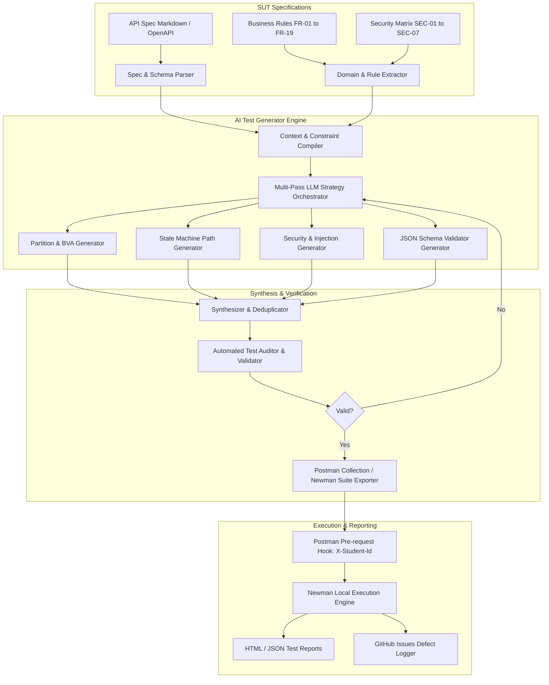

```mermaid
flowchart TD
    subgraph SUT_Input [SUT Specifications]
        A1[API Spec Markdown / OpenAPI] --> B[Spec & Schema Parser]
        A2[Business Rules FR-01 to FR-19] --> C[Domain & Rule Extractor]
        A3[Security Matrix SEC-01 to SEC-07] --> C
    end

    subgraph Agent_Core [AI Test Generator Engine]
        B --> D[Context & Constraint Compiler]
        C --> D
        D --> E[Multi-Pass LLM Strategy Orchestrator]
        
        E --> F1[Partition & BVA Generator]
        E --> F2[State Machine Path Generator]
        E --> F3[Security & Injection Generator]
        E --> F4[JSON Schema Validator Generator]
    end

    subgraph Post_Processing [Synthesis & Verification]
        F1 & F2 & F3 & F4 --> G[Synthesizer & Deduplicator]
        G --> H[Automated Test Auditor & Validator]
        H --> I{Valid?}
        I -- No --> E
        I -- Yes --> J[Postman Collection / Newman Suite Exporter]
    end

    subgraph Execution [Execution & Reporting]
        J --> K[Postman Pre-request Hook: X-Student-Id]
        K --> L[Newman Local Execution Engine]
        L --> M[HTML / JSON Test Reports]
        L --> N[GitHub Issues Defect Logger]
    end
```