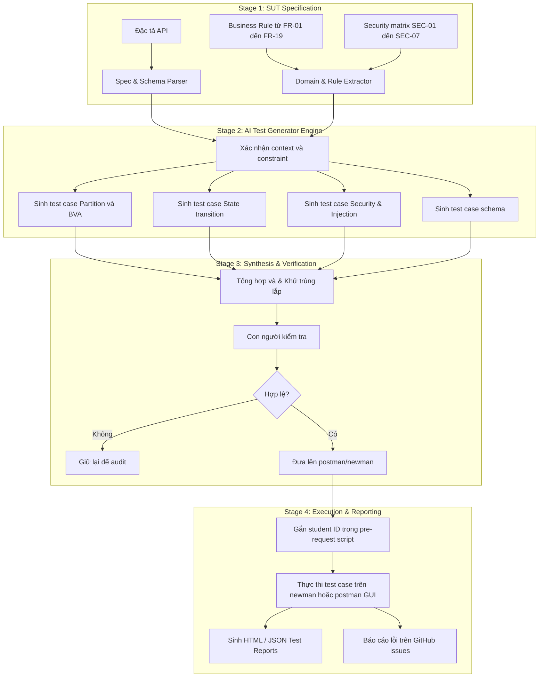

* Các bước thực hiện
    - Đọc các đặc tả của hệ thống
    - AI thực hiện sinh ra những test case dựa trên đặc tả được đưa (bao gồm Partiton, Security, State, Schema)
    - Các test case được sinh ra sẽ được người dùng kiểm tra lại trước khi đưa lên Postman/Newman
    - Người dùng thực hiện các test case, sinh test report, báo cáo lỗi trên github issues