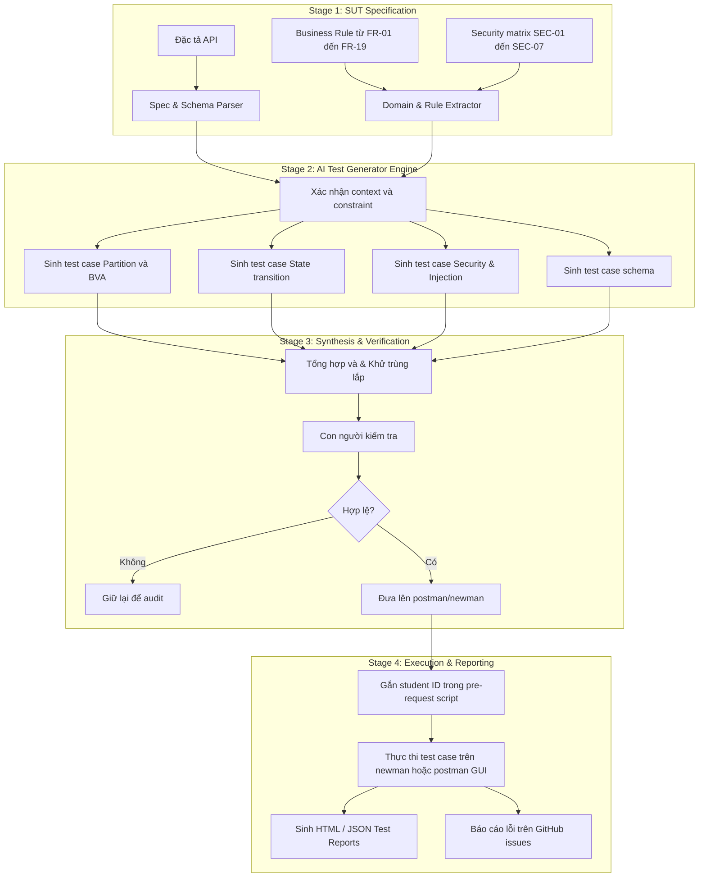

# HW06 - API Testing 

### THÔNG TIN SINH VIÊN

- **Họ và tên:** Lê Hữu Minh Quang
- **Mã số sinh viên:** 23127108
- **Lớp:** 23KTPM4
- **Repository GitHub:** https://github.com/fgounlimitedluckgame/HW06

---

## 1. Danh sách 3 API được lựa chọn

| Nhóm (Pool) | Mã Tính Năng  | API Endpoint             | Phương Thức | Mô Tả Nghiệp Vụ                             |
| :---------- | :-----------: | :----------------------- | :---------: | :------------------------------------------ |
| **Pool A**  |     FR-01     | `/api/register`          |   `POST`    | Đăng ký tài khoản khách hàng mới            |
| **Pool B**  | FR-07         | `/api/cart` |    `POST`    | Tương tác giỏ hàng  |
| **Pool C**  |     FR-15     | `/api/categories`        |   `POST`, `PUT`, `DELETE`    | Quản lý sản phẩm (Dành cho Admin) |

## 2. Quy trình thực hiện AI test generator:
* **Flow chart:** (lưu trong [flowchart.md](diagrams/flowchart.md))

* Các bước thực hiện
    - Đọc các đặc tả của hệ thống
    - AI thực hiện sinh ra những test case dựa trên đặc tả được đưa (bao gồm Partiton, Security, State, Schema)
    - Các test case được sinh ra sẽ được người dùng kiểm tra lại trước khi đưa lên Postman/Newman
    - Người dùng thực hiện các test case, sinh test report, báo cáo lỗi trên github issues

* Pseudocode: [diagrams/pseudocode.py](diagrams/pseudocode.py) 

## 3. Các tính năng Postman đã sử dụng:
1. **Workspace & Collections:** Tổ chức suite test
2. **Environment Variables:** Dùng để lưu trữ một số biến như `base_url`, `admin_token`, `user_token`
3. **Request-level pre-request scripts:** Dùng để chèn thông tin từ env, và thông tin header
4. **Data-driven testing:** Các API request sẽ được tổ chức dưới file CSV để thuận tiện cho việc test
5. **Request-level post-request scripts:** Dùng để validate các status code, giữ ID body để xác nhận state transition, chạy custom assertion script từ CSV
6. **Console Logging & Newman CLI / HTML Extra:** Xuất báo cáo newman
7. **Chaining Requests:** Trích xuất tự động token và ID giữa các request tuần tự.

## 4. Danh sách test case
| API | AI-generated | Manual extension | Tổng | `VALID` | `INCOMPLETE` | `INVALID` |
|---|---:|---:|---:|---:|---:|---:|
| FR-01 | 35 | 5 | 40 | 38 | 2 | 0 |
| FR-07 | 35 | 5 | 40 | 35 | 5 | 0 |
| FR-15 | 35 | 5 | 40 | 36 | 4 | 0 |
| **Tổng** | **105** | **15** | **120** | **109** | **11** | **0** |

- **Các test case `INCOMPLETE`**:
    - FR01: `FR01-ST-029` và `FR01-ST-030`
    - FR07: `FR07-ST-024` đến `FR07-ST-028`
    - FR15: `FR07-ST-024` đến `FR07-ST-027`
- **Vì sao đánh dấu `INCOMPLETE`:** Các assertion script đều được viết dưới dạng pseudocode thay vì javascript để kiểm tra trạng thái sau. 
- **Cách sửa:** Chỉ coi các assertion script bị lỗi đó như là giả thuyết để kiểm thử tiếp, kết quả sẽ hoàn toàn dựa theo response code

---

- **Ghi chú 1:** Chi tiết các test case của FR01, FR07, FR15 được lưu trong các file .xlsx trong folder `test_cases` (các file: `fr01_table_xlsx`, `fr07_table_xlsx`, `fr15_table.xlsx`)

- **Ghi chú 2:** 5 test case được thêm vào ngoài việc AI sinh ra có tag EXT và có miêu tả Tiếng Việt. Lí do cơ bản mà AI không sinh ra những test case đó vì AI viết 35 test case dựa trên những pattern quen thuộc nhất, còn 5 test case còn lại của mỗi FR được thêm vào để bù trừ thiếu sót

- **Ghi chú 3:** Data CSV được dùng (lưu trong thư mục `test_data`):
    - [FR01 test cases](test_data/fr01_testcases.csv) (đường dẫn: `test_data/fr01_testcases.csv`)
    - [FR07 test cases](test_data/fr07_testcases.csv) (đường dẫn: `test_data/fr07_testcases.csv`)
    - [FR15 test cases](test_data/fr15_testcases.csv) (đường dẫn: `test_data/fr15_testcases.csv`)

- **Ghi chú 4:** File environment có tên là `hw06.postman_environment.json`

- **Ghi chú 5:** File collection có tên là `hw06.postman_collection.json`

- **Ghi chú 6:** Các file report html được lưu trong thư mục `reports`

---

## 5. Kết quả chạy:
| API | Scenario rows | Passed rows | Failed rows |
|---|---:|---:|---:|
| FR-01 | 40 (35 + 5) | 11 | 29 |
| FR-08 | 40 (35 + 5) | 13 | 27 |
| FR-15 | 40 (35 + 5) | 15 | 25 |
| **Tổng** | **120** | **39** | **81** |

## 6. Báo cáo lỗi

Đọc chi tiết tại [bug_report.md](bug_report.md)

## 7. Tích hợp CI/CD:

Cấu hình file CI/CD có thể được tìm thấy ở [api-tests-yml](.github/workflows/api-tests.yml)

- **Luồng chạy:** Khi commit  `push` hoặc `pull_request` liên quan file CSV chứa API test case ở trong thư mục `api_tests`, GitHub Actions tự động dựng môi trường `ubuntu-latest`, cài đặt Node.js 20, khởi động backend EShop trong nền, đợi server sẵn sàng (`wait-on`), thực thi Newman CLI và upload artifact báo cáo HTML Extra.
- **Hai kịch bản chạy (Sample Runs):**

  **1. Kịch bản Pass toàn bộ:** Chạy kiểm thử hồi quy các luồng chuẩn thành công 100%.

  **2. Kịch bản Phát hiện Lỗi:** Trong bộ test có ít nhất một case lỗi, ghi nhận cảnh báo fail

Đọc chi tiết trong [CICD_report.md](CICD_report.md)

